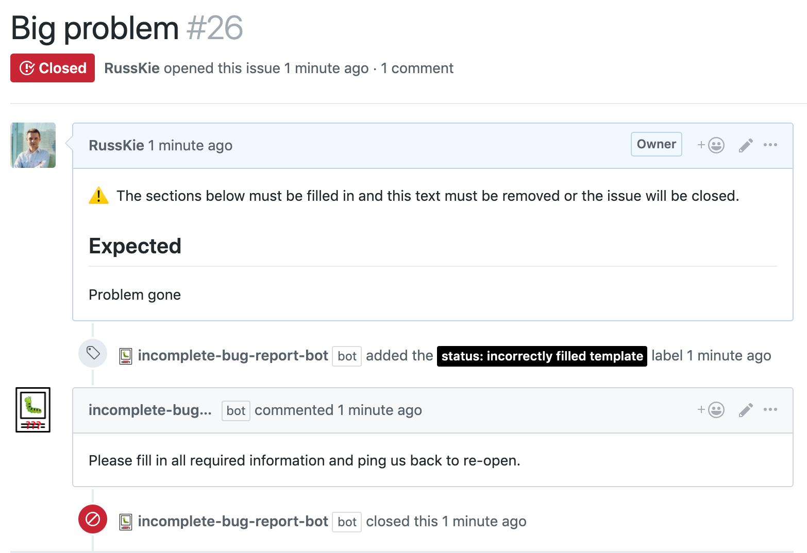

# incomplete-bug-report-bot

A configurable GitHub [Probot App](https://github.com/probot/probot) which checks whether a submitted bug reports contains necessary information.

The app has been built for an integration with [Git Extensions](https://github.com/gitextensions/gitextensions/) and NBug error report submissions, but with few tweaks can be turned into a general purpose duplicate checker bot.




# Usage

* You can deploy our Github App manually. For example to Glitch ([guide from Andrew Lock](https://andrewlock.net/creating-my-first-github-app-with-probot-part-3-deploying-to-glitch/))
* Then, you can create a custom configuration file at `.github/incomplete-bug-report.yml`. If this file doesn't exists, default settings will be used:

```yml
# Label name and color to set, when potential duplicates are detected
issueLabel: "status: incorrectly filled template"

# Comment to post when potential duplicates are detected
referenceComment: >
  Please fill in all required information and ping us back to re-open.
```


## Deploying

If you would like to run your own instance of this app, see the [docs for deployment](https://probot.github.io/docs/deployment/). This app requires both `Issues – Read & Write` and `Single File – Read` (`.github/potential-duplicates.yml`) permissions & events.


## Setup

```sh
# Install dependencies
npm install

# Run the bot
npm run dev
```

## Contributing

If you have suggestions for how incomplete-bug-report-bot could be improved, or want to report a bug, open an issue! We'd love all and any contributions.

For more, check out the [Contributing Guide](CONTRIBUTING.md).

## License

[ISC](LICENSE) © 2019 Igor Velikorossov (https://github.com/RussKie/incomplete-bug-report-bot)
